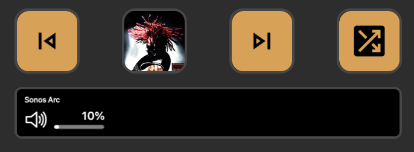

# Sonos for Stream Deck



A Stream Deck plugin that provides control of your Sonos speakers directly from your Elgato Stream Deck. Easily play/pause music, adjust volume, skip tracks, toggle shuffle mode, and more with just a tap or dial rotation.

## Features

- **Play/Pause Control**: Toggle playback on your Sonos speaker with a single key press
- **Volume Control**: Use the Stream Deck+ dial to adjust volume with haptic feedback
- **Track Navigation**: Skip to next or previous tracks in your queue
- **Shuffle Mode**: Toggle shuffle on/off with visual feedback
- **Real-time Status Updates**: View current playback status and track information
- **Cover Art Display**: See album artwork on your Stream Deck keys during playback

## Requirements

- Elgato Stream Deck hardware (any model)
- Stream Deck software v6.4 or later
- Sonos speaker(s) on the same network
- Node.js v24 or later (for development only)

## Installation

### Manual Installation

1. Download the latest release from the [Releases](https://github.com/pkarpovich/streamdeck-sonos/releases) page
2. Double-click the downloaded file to install
3. The plugin will appear in your Stream Deck application

## Setup

1. After installation, drag any Sonos action from the "Sonos" category to your Stream Deck
2. On first use, the plugin will automatically discover Sonos devices on your network

## Available Actions

### Play/Pause Button
Control playback of your current Sonos queue. The button will update to show the current state (playing/paused) and displays album artwork when playing.

### Volume Dial (Stream Deck+ only)
Rotate the dial to adjust volume. Press the dial to toggle mute. Tap the touchscreen to play/pause. Long-press the touchscreen to reset volume to 25%.

### Next Track Button
Skip to the next track in your queue.

### Previous Track Button
Go back to the previous track in your queue.

### Shuffle Toggle Button
Enable or disable shuffle mode for your current queue. The button will update to show the current state.

## Development

### Prerequisites
- Node.js v24 or later
- pnpm
- Elgato Stream Deck software
- Stream Deck CLI (`npm install -g @elgato/cli`)

### Getting Started

1. Clone the repository:
```bash
git clone https://github.com/pkarpovich/streamdeck-sonos.git
cd streamdeck-sonos
```

2. Install dependencies:
```bash
pnpm install
```

3. Build the plugin:
```bash
pnpm build
```

### Testing the Plugin

1. Link the plugin to Stream Deck (creates a symlink, only needed once):
```bash
pnpm exec streamdeck link com.pavel-karpovich.sonos.sdPlugin
```

2. After making changes, rebuild and restart:
```bash
pnpm build
pnpm exec streamdeck restart com.pavel-karpovich.sonos
```

### Development with Hot-Reload

For development with automatic rebuild and restart on file changes:
```bash
pnpm watch
```

### Other Commands

```bash
pnpm validate  # Validate plugin manifest
pnpm pack      # Create .streamDeckPlugin distribution file
```

## Troubleshooting

- **No devices found**: Ensure your Sonos speakers are on the same network as your computer
- **Cannot control playback**: Check that your speaker isn't grouped with another speaker that's the group coordinator
- **Plugin not appearing**: Try restarting the Stream Deck software

## License

This project is licensed under the MIT License - see the LICENSE file for details.

## Acknowledgments

- [Sonos API Library](https://github.com/svrooij/node-sonos-ts) - The TypeScript Sonos library used in this plugin
- [Stream Deck SDK](https://docs.elgato.com/streamdeck/sdk/) - Elgato's SDK for Stream Deck plugin development
- [Original Plugin](https://github.com/GenericMale/streamdeck-sonos) - The original Sonos plugin that inspired this project

---

## Support

If you encounter any issues or have feature requests, please [open an issue](https://github.com/pkarpovich/streamdeck-sonos/issues) on GitHub.